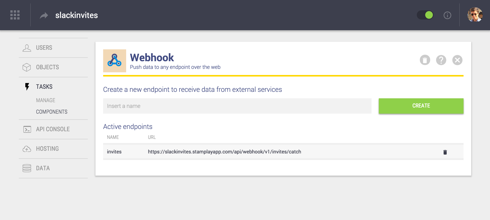
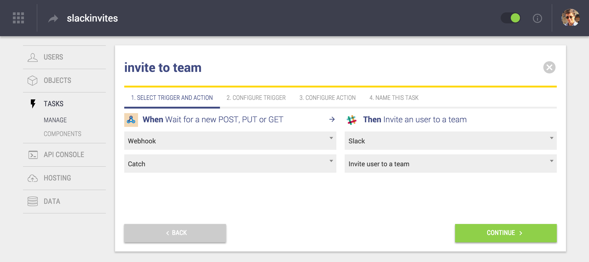
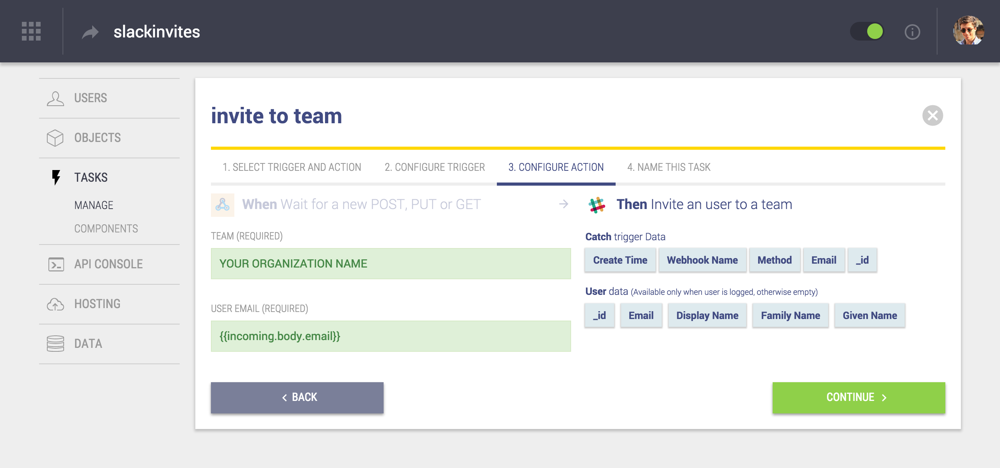

# slack-invites
At Stamplay, we love Slack. It's a communication tool that we can't live without. We started using for our internal communications but it didn't took too much before realizing that we could use it for our community as well.

Slack doesn’t allow people to sign up directly though. The team’s admin needs to invite people manually. Here, we'll show how we've built an app with Stamplay to transform Slack into a community platform.

This app will let you build a landing page to invite users to your Slack organization. You can point users to this page to fill in their emails and receive an invite.


## How it works

The app is composed by a landing page with a simple form and a back-end which collect the data from the form and uses Slack's APIs to send an invite. Let's start building the app by logging into [your account](http://editor.stamplay.com/apps) and create a new app. Once the app has been initialized we need to add two modules.

#### Webhook
Webhook component let you create API endpoints to receive data. We'll use this to capture users' email addresses that will be sent from the landing page. Creating a new endpoint using Webhook module is super simple:

* Go to Task -> Components and click on "Webhook"
* Type a name for the webhook URL, let's call it `"invites"` and hit Create



#### Connect Slack
Now we need to enable Stamplay to connect with Slack. 

* Go to Task -> Components and click on "Slack"
* Click the connect button, a new tab will be open
* Select the Slack organization that will be joined by your users and then click on "Authorize"

Both components have been successfully activated, now let's make them work together. 

#### Developing the front-end

Clone this repository or download the front-end files as a [zip file](https://github.com/Stamplay/slack-invites/archive/master.zip ) and extract it into a new directory. In order to upload the front-end files you need to install the `stamplay-cli` package via NPM.

* `npm install -g stamplay-cli`

Now you can run `stamplay init` in your project directory, a stamplay.json file will be initialized. You’ll need your app’s APP ID and API KEY both of which can be found on your app's dashboard or in the **Hosting** view.

#### Add AppId and WebhookId in the index.html

Open up `index.html`. At the very end of the file edit the following lines, replacing the value of `stamplay_appid` and `stamplay_webhookid` with your informations:

```html
	<script>
		var stamplay_appid = "STAMPLAY_APPID";
		var stamplay_webhookid = "WEBHOOK_ID";
	</script>
```

#### Uploading the front-end
Simply run `stamplay deploy` in the project directory. When that’s complete you can see your app live at `https://yourappid.stamplayapp.com`. If you try to submit an email address it should work.

#### Creating the task a slack invite whenever a new user submit the email
Click on “Manage” under “Tasks” in the Stamplay left hand menu, then click “New Task”. We’re going to select: “When a Webhook-  catches a request, Slack – invite an user to a team”



Click “Continue” to get to Step 3 where you can use the values on the right to populate your Slack invite request.



You're now ready to go, start pointing your users to `https://yourappid.stamplayapp.com` and they will be able to singup to your Slack organization in a breeze. As usual, for any questions drop an email to [giuliano.iacobelli@stamplay.com](mailto:giuliano.iacobelli@stamplay.com) or join our Slack organization here [https://slackinvites.stamplayapp.com](https://slackinvites.stamplayapp.com).

Cheers,


